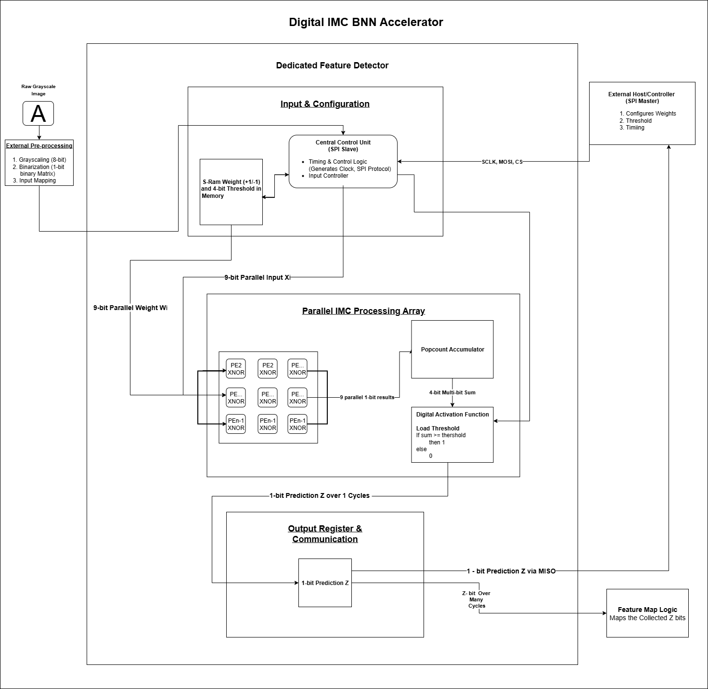

# Digital IMC BNN Accelerator for Real-Time Space Debris Classification

   

> **Complete project for designing a Binarized Neural Network (BNN) from a high-level software model to a verified hardware RTL implementation, aimed at real-time, on-board space debris classification.**

---

## Project Goals

This repository documents a complete design flow with two primary objectives:

1.  **Software Golden Model**: To develop and train a BNN in PyTorch that can accurately classify space debris from simulated sensor data. This model serves as the "golden reference" for functional correctness.
2.  **Hardware RTL Implementation**: To design a modular, efficient, and verifiable hardware accelerator in Verilog that implements the most computationally intensive layers of the BNN, preparing it for a future ASIC tapeout.

## The Problem: A Crowded Sky

The increasing amount of space debris poses a critical threat to operational satellites. For small, power-constrained nanosatellites, relying on ground control for collision avoidance is often too slow due to communication latency. Therefore, a need exists for autonomous, on-board AI that can make instantaneous decisions within an extremely tight power budget.

## The Solution: A Hardware-Aware BNN

This project tackles the problem by developing a **3-Layer Binarized Neural Network**. BNNs are ideal for this task as they constrain both weights and activations to only two values (`+1` or `-1`). This simplification replaces power-hungry multiplication operations with highly efficient bitwise **XNOR** and **Popcount** logic, making them perfectly suited for custom, low-power hardware accelerators.

---

## System Architecture: Hardware/Software Co-Design

The system is designed as a hardware/software co-design where the most demanding computations are offloaded to a dedicated hardware block (the "accelerator"), managed by a host controller (e.g., a simple CPU).

| Component | Layer | Role & Logic | Target Platform |
| :--- | :--- | :--- | :--- |
| **Custom Hardware** | Binary Conv1 | **Primary Feature Extraction**. The most computationally intensive layer, designed with a parallel XNOR array. | **Verilog/RTL** |
| **Host Software** | Binary Conv2 | **Feature Aggregation**. Finds higher-level patterns from the hardware-extracted features. | **Microcontroller/CPU** |
| **Host Software** | Binary FC | **Final Classification**. A dense layer that makes the final "Debris" or "Safe" decision. | **Microcontroller/CPU** |

---

##  verilog Hardware Accelerator Design (RTL)

The core of the hardware implementation is a modular, bottom-up Verilog design that creates a reusable and verifiable accelerator.

### Design Hierarchy & Modules

The accelerator is composed of a computational datapath and a control interface. Each module has been individually designed and verified.

| Module File | Purpose | Status |
| :--- | :--- | :--- |
| `pe_xnor.v` | **Processing Element**. The core computational unit performing a single XNOR operation. | Complete & Verified |
| `imc_processing_array.v` | **IMC Array**. A 3x3 parallel array of 9 `pe_xnor` instances for simultaneous computation. | Complete & Verified |
| `popcount_accumulator.v` | **Popcount Accumulator**. Counts the number of '1's from the IMC array output using an efficient adder tree. | Complete & Verified |
| `digital_activation.v` | **Activation Function**. Compares the popcount sum to a programmable threshold to produce a 1-bit output. | Complete & Verified |
| `bnn_datapath.v` | **Integrated Datapath**. Connects the four modules above into a complete computational pipeline. | Complete & Verified |
| `spi_slave.v` | **SPI Interface**. The communication port to receive weights, thresholds, and pixel data from a host controller. | Complete & Verified |
| `accelerator_top.v` | **Top Module**. The final module that will integrate the datapath, SPI slave, memory, and control logic (FSM). | *In Progress* |

### Verification Strategy

A rigorous, bottom-up verification strategy was employed using dedicated Verilog testbenches (`_tb.v`) for each module. This ensures that fundamental blocks are correct before being integrated into larger systems, leading to a robust and functionally correct final design.

---

## Software Golden Model (PyTorch)

The `BNN_Space_Debris_Classification.ipynb` notebook contains the complete PyTorch implementation of the system. It serves as a functional model and a "golden reference" for verifying the hardware design.

### Experiment 1: MNIST Benchmark
The BNN architecture is first validated on the standard **MNIST handwritten digit dataset** to establish a performance baseline and verify the custom binarization layers.

### Experiment 2: Space Debris Classification
This is the core application. The BNN is trained to classify simulated sensor maps as "Safe" or containing "Debris".
* **Data Source**: **Two-Line Element (TLE)** orbital parameters for all tracked satellites and debris, downloaded automatically from **Celestrak**.
* **Image Generation**: The `skyfield` library propagates TLE orbits to generate 28x28 2D "sensor maps" that simulate a satellite's field of view. These binarized maps, resembling QR codes, are ideal for BNN processing.

## Repository Contents

* `.`
* ├── `BNN_Space_Debris_Classification.ipynb`: The main Jupyter Notebook with the PyTorch model and experiments.
* ├── `verilog/`: Directory containing all hardware RTL source code and testbenches.
* ├── `docs/`: Contains project documentation, including the final PDF report.
* ├── `Final_IMCfornow.drawio.png`: The system architecture diagram.
* └── `README.md`: You are here!

## Project Status

-   [x] **Software Model**: BNN core components in PyTorch are complete.
-   [x] **Benchmarking**: Model successfully benchmarked on MNIST.
-   [x] **Data Generation**: TLE data pipeline and image generator are fully functional.
-   [x] **Hardware RTL Design**: All datapath and communication modules (`pe_xnor` to `datapath` and `spi_slave` (working on)) are designed in Verilog.
-   [ ] **Hardware RTL Verification**: All designed modules have been successfully verified with dedicated testbenches.
-   [ ] **Hardware Integration**: Design of the final top-level FSM to integrate all hardware modules.
-   [ ] **ASIC Backend Flow**: Logic Synthesis, Place & Route, and Sign-off.

## Getting Started

### Running the Software Model
1.  **Prerequisites**: A Google Colab account or a local environment with Python 3.8+ and Jupyter.
2.  **Setup**: Clone this repository. The first cell in the `.ipynb` notebook will install all necessary packages (`!pip install skyfield`).
3.  **Execution**: Run the cells in the notebook sequentially to train the model and see the results.

### Simulating the Hardware
1.  **Prerequisites**: A Verilog simulator such as Xilinx Vivado, Icarus Verilog, or Siemens/Mentor QuestaSim.
2.  **Execution**:
    * Create a project in your simulator.
    * Add the Verilog files from the `/verilog` directory.
    * Set the desired testbench (e.g., `bnn_datapath_tb.v`) as the top simulation module and run the behavioral simulation.
